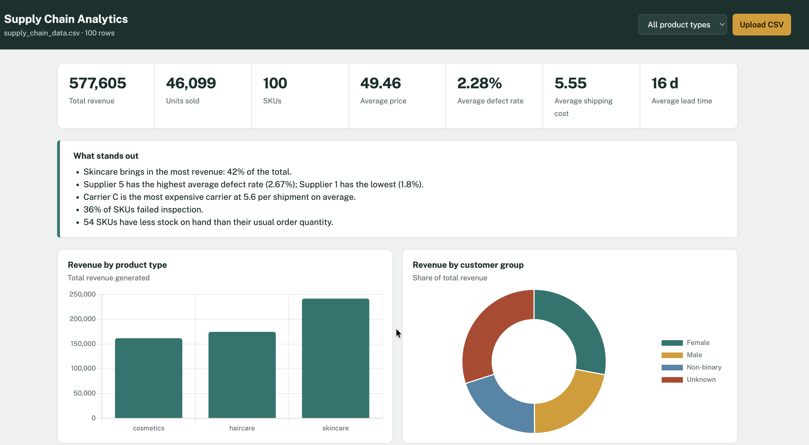

# Supply chain analytics dashboard

    pip install -r requirements.txt
    python app.py        # http://127.0.0.1:5000
    or
    gunicorn -w 1 --threads 4 -b 0.0.0.0:8001 app:app
Put your CSV at `data/supply_chain_data.csv` to load it on start, or upload one in the browser.
Required columns: Product type, SKU, Price, Number of products sold, Revenue generated.
Other columns (supplier, carrier, defect rate, etc.) unlock more charts; missing ones are skipped.
Uploads are held in memory for one user; restart the app to return to the default file.
